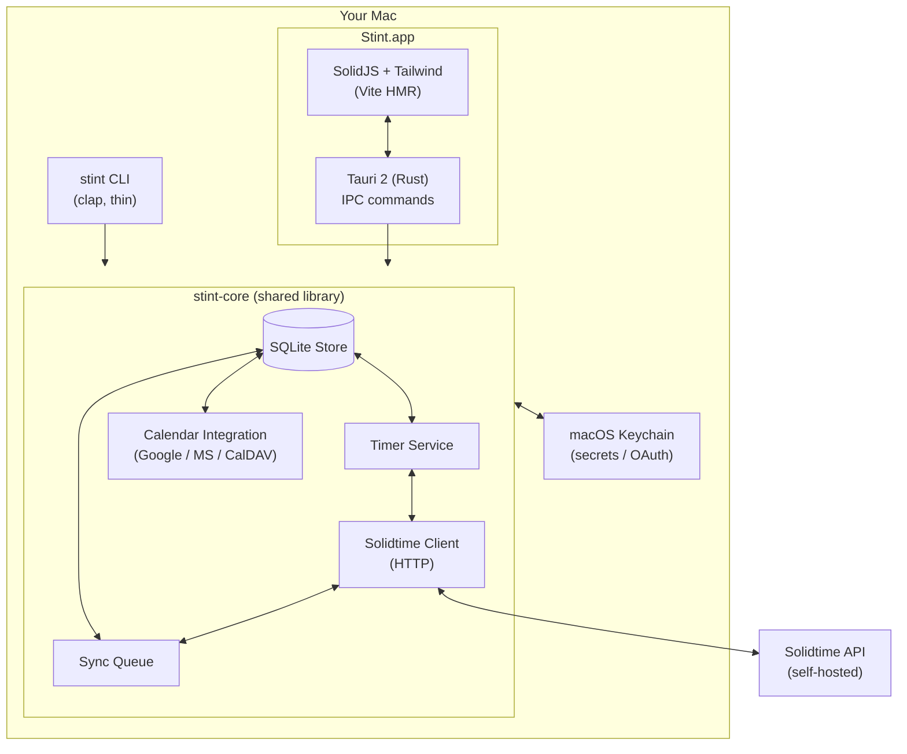

<picture>
  <source media="(prefers-color-scheme: dark)" srcset="https://raw.githubusercontent.com/reyemtech/stint/main/.github/brand/stint-logotype-dark.svg">
  
</picture>

**A time tracker for developers who want the speed of a CLI and the convenience of a menu-bar app — without sending your data to a third party.**

<p>
  <a href="https://github.com/reyemtech/stint/actions/workflows/ci.yml"></a>
  <a href="https://github.com/reyemtech/stint/releases/latest"></a>
  <a href="LICENSE"></a>
  <a href="https://reyemtech.github.io/stint"></a>
  
  
</p>

---

<p align="center">
  
</p>

## Quick start

```bash
brew tap reyemtech/tap
brew install --cask stint
```

Launch Stint.app from your Applications folder — it lives in your menu bar.
Point it at your Solidtime instance and start tracking:

```bash
stint config set solidtime.url https://time.your-org.com
stint start "designing the sync model"
stint stop
stint today          # see what you logged
```

That's it. Your time is stored locally in SQLite and synced to your own
Solidtime server in the background.

**Prefer a standalone CLI?** No GUI needed:

```bash
curl -fsSL https://stint.reyem.tech/install.sh | sh
```

---

## Why stint?

**Toggl / Clockify** send your data to someone else's server and don't have
a serious CLI. **Watson / tt** are terminal-only with no menu bar, calendar
integration, or sync. **Hamster** is unmaintained.

stint is the time tracker you'd write for yourself:

- **Two surfaces, one database.** CLI when you're in the terminal, GUI when
  you want to glance at the menu bar. Both share `~/Library/Application Support/stint/stint.db`.
  Start a timer in the terminal and see it update in the menu bar within a second.
- **Local-first.** Every mutation writes to SQLite immediately. Sync happens
  in the background — offline is fine, queue drains when you reconnect.
- **Self-hosted.** Your data stays on your Solidtime instance. No monthly
  SaaS bill, no third-party API dependency.
- **Calendar-aware.** Connect Google Calendar, Microsoft, or CalDAV — read
  events and log them with one click. stint learns your project defaults
  so you barely have to type.
- **OAuth + PAT.** Personal access tokens for quick setup, OAuth 2.0 PKCE
  for automatic token rotation. Your choice per instance.

---

## Features

| | |
|---|---|
| **⌨️ CLI + 🖥️ GUI** | Track from the terminal or the menu bar. Same data, same database, instant cross-surface updates. |
| **📡 Local-first sync** | Offline-safe. Writes queue locally and flush with exponential backoff when connectivity returns. |
| **📅 Calendar import** | Read-only Google, Microsoft, and CalDAV. Convert events to time entries. Per-calendar include/exclude. |
| **🔐 OAuth + PAT** | Personal access tokens or OAuth 2.0 PKCE against your Solidtime instance. Tokens stored in macOS Keychain. |
| **♻️ Crash recovery** | Journaled queue won't lose entries. Recovery worker patches gaps on restart. |
| **🔄 Live updates** | Timer state polls every 1s. `stint start` in the terminal, see it in the menu bar instantly. |
| **📦 Self-updating** | Auto-update via `tauri-plugin-updater`. `stint update` for CLI-only installs. |
| **🏠 Self-hosted** | Your Solidtime, your rules. No data leaves your infrastructure. |

---

## Architecture



**Key design decisions:**

- **`stint-core` is the only place business logic lives.** CLI and Tauri
  commands are thin wrappers: parse input → call core → format output.
- **SQLite is the source of truth.** The Solidtime server is a sync target,
  not the primary store. Offline work never blocks.
- **Secrets never touch disk unencrypted.** OAuth tokens, PATs, and calendar
  credentials live in macOS Keychain under `tech.reyem.stint.*`.
- **Sync is a queue, not a transaction.** Mutations write locally first, then
  enqueue for upload. The worker drains with exponential backoff. If a
  mutation conflicts on the server, the queue entry is abandoned and surfaced.

---

## Documentation

Full documentation lives at **[stint.reyem.tech](https://stint.reyem.tech)**:

- [Installation & setup](https://stint.reyem.tech/install)
- [CLI reference](https://stint.reyem.tech/cli)
- [GUI walkthrough](https://stint.reyem.tech/gui)
- [Solidtime OAuth setup](https://stint.reyem.tech/oauth)
- [Calendar configuration](https://stint.reyem.tech/calendar)
- [Troubleshooting](https://stint.reyem.tech/troubleshooting)

---

## Development

### Prerequisites

```bash
brew install pnpm rust
cargo install tauri-cli --version "^2.0" --locked
pnpm install
```

### Build & test

```bash
cargo build --workspace
cargo test --workspace -- --test-threads=1
cargo clippy --workspace --all-targets -- -D warnings
```

### Dev loops

```bash
# CLI
cargo run -p stint-cli -- start "debugging sync"

# GUI (Tauri + Vite HMR)
cd crates/stint-app && cargo tauri dev

# UI only (Vite without Tauri shell)
cd ui && pnpm dev
```

### Project structure

```
crates/
  stint-core/       # Business logic: store, sync, timer, Solidtime client
  stint-cli/        # CLI binary (thin clap wrappers)
  stint-app/        # Tauri 2 binary (windows, tray, IPC)
ui/                 # SolidJS + Tailwind frontend
site/               # Astro documentation site
docs/superpowers/   # Design specs & implementation plans
```

### Testing conventions

- **TDD for `stint-core`** — write the failing test, then the implementation.
- **Integration over unit** for store-level code — tests run against a real
  SQLite tempdir.
- **Wiremock for HTTP** — Solidtime API tests never touch a real server.
- **`assert_cmd` for CLI** — end-to-end binary tests.

### Conventions

- **Commits:** [Conventional Commits](https://www.conventionalcommits.org/)
  with scopes (`feat(core):`, `fix(sync):`, `chore(ui):`, …).
- **Branching:** `phase-N` branches from `main`, merged via merge commit,
  tagged as `phase-N-complete`.
- **Code style:** idiomatic Rust, no `unwrap` in production paths, typed
  errors at the library boundary. SolidJS signals only — no class components.

---

## Contributing

stint is developed in phases. Each phase has a written spec, a plan, and
a `phase-N` branch. See the [open issues](https://github.com/reyemtech/stint/issues)
and [phase roadmap](https://stint.reyem.tech/roadmap) for what's next.

1. Read the [design spec](docs/superpowers/specs/2026-05-17-stint-design.md).
2. Fork the repo and create a branch from `main`.
3. Write tests first for core changes.
4. Open a PR. CI runs lint, test, and typecheck.

Small bug fixes and doc improvements are always welcome without a phase
branch.

---

## Roadmap

| Phase | Scope | Status |
|---|---|---|
| 1 | CLI + sync + crash recovery | ✅ shipped |
| 2 | Tauri GUI + SolidJS UI | ✅ shipped |
| 2.5 | CI baseline (lint / test / typecheck) | ✅ shipped |
| 3a | OAuth 2.0 foundation + Solidtime OAuth | ✅ shipped |
| 3b | Calendar (Google + MS + CalDAV) | ✅ shipped |
| 3c | Solidtime down-sync | ✅ shipped |
| 3.5 | Test coverage uplift | ✅ shipped |
| 3d | UX polish + sync resilience | ✅ shipped |
| 4 | Distribution (Homebrew cask + signing + release CD) | ✅ shipped |
| 5 | Documentation site (GitHub Pages) | ✅ shipped |
| 6a | verbs façade + MCP + HTTP API + URL scheme + skill installer | ✅ shipped |
| 6b | Spotlight + App Intents + Focus filter | ⚠️ partial — Spotlight tap-to-focus-entry works; Siri/Shortcuts.app discovery deferred |
| 6c | Raycast + Alfred + WidgetKit + idle detection | ✅ shipped |

---

## License

MIT © [Reyem Technologies Inc.](https://reyem.tech)

---

<p align="center">
  <a href="https://reyem.tech">reyem.tech</a> ·
  <a href="https://github.com/reyemtech/stint">GitHub</a> ·
  <a href="https://stint.reyem.tech">Docs</a>
</p>
